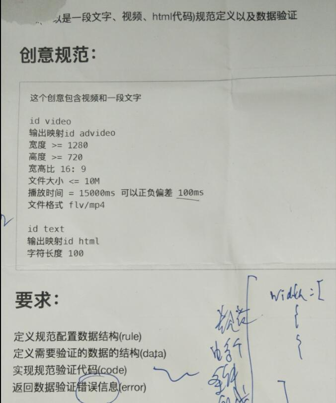

# DataChecker
数据检验工具

## 要求

### 附加要求
1. 错误提示不要写死，要具体，例如是数据里面是mkv格式，要求mp4或者flv，那就提示mkv不在mp4,flv范围内，提示格式可以是：
哪一项+其value+提示(每个操作符都不同)+其rule里面的指定数据
2. data里面需要同时支持video和text
3. offset考虑只支持正offset或者负offset，或者没有offset, 或者正负其中一个，如果视频长度要求是15000或者30000，同时要求这两个值都支持offset，最好也能支持
4. rule里面，$eq是默认规则，支持不写
5. 支持rule里面有些字段不参与验证
6. 如果时间来得及，使用测试框架来写测试用例
7. 可以考虑github来提交代码